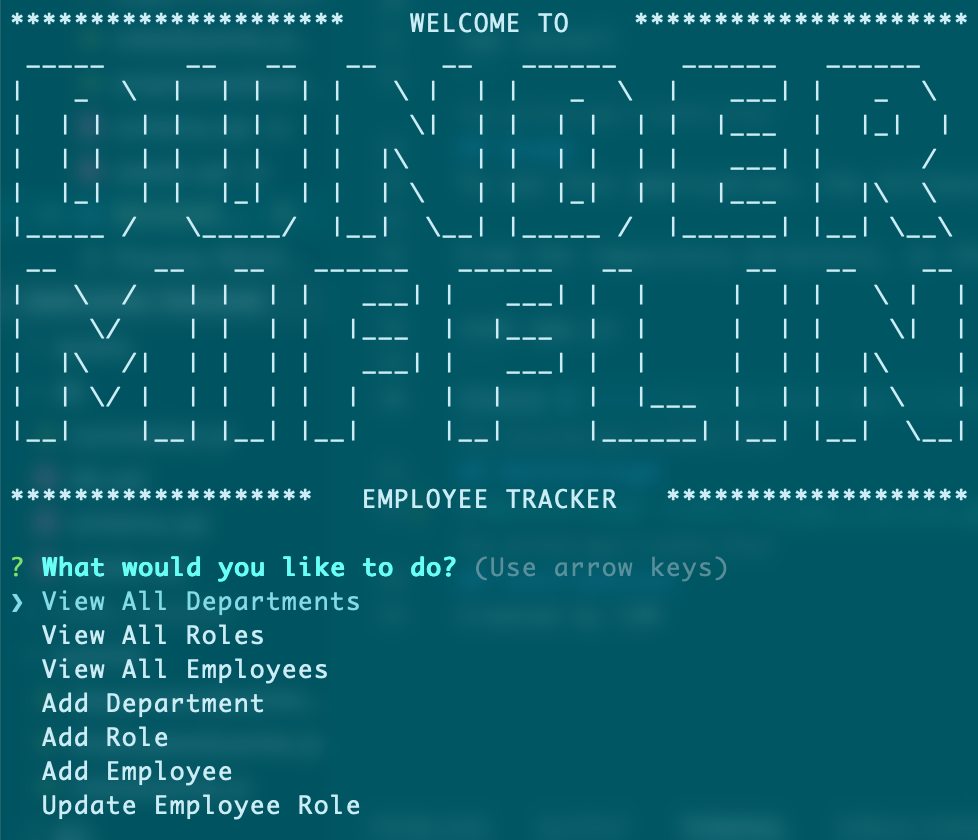

# Employee Tracker
## Purpose
CLI application for managing employee database, including viewing departments, roles, and staff, adding new departments, roles, and staff, and updating employee roles.
## Table of Contents
- [Built With](#built-with)
- [Installation](#instalaltion)
- [Usage](#usage)
- [Tests](#tests)
- [Walkthrough](#walkthrough)
- [Contribution](#contribution)
## Built With
-  Node.js
- Inquirer
- MySQL
## InstallationTo install this application, the following steps must be taken:
1. Install Node.js
2. Clone this repository
3. Access repository directory through terminal
4. Install Inquirer.js and MySQL2 by typing the following into the terminal: 
```
npm install
```
## Usage
To use this application, the following steps must be taken:

From the repository directory, in the terminal, type the following:
```
node app.js
```
Choose an option
## Walkthrough
Please click on the following image to view a demonstration of the application: 

[](https://drive.google.com/file/d/1Hz35Bf26F6Utcj8-qgf9dPZJIX29Rq_0/view?usp=sharing)
## Contribution
Created by CSM